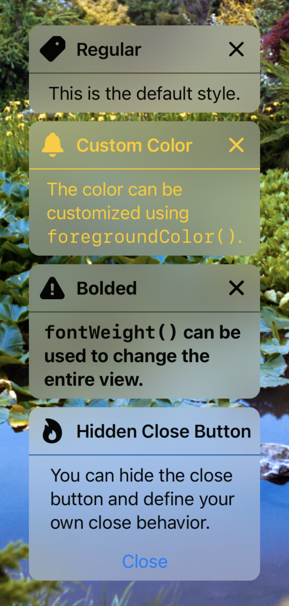

# CUIExpandableButton

A SwiftUI button that expands to reveal more content.


[](https://swiftpackageindex.com/robhasacamera/CUIExpandableButton)
[](https://swiftpackageindex.com/robhasacamera/CUIExpandableButton)

CUIExpandableButton is part of the Crystal UI framework (under developement). This framework is working to bring a suite of UI components that utilize [SwiftUI Material](https://developer.apple.com/documentation/swiftui/material) for it's background element. 

## Usage

To create a simple CUIExpandableButton, you can use an SF Symbol for your icon.

```swift
CUIExpandableButton(
    expanded: $expanded,
    sfSymbolName: "gearshape.fill"
) {
    Text("My content")
}
```

If you'd like more control, you can provide a custom icon for the button instead.

```swift
CUIExpandableButton(
    expanded: $expanded
) {
    Image("icon")
        .resizable()
        .aspectRatio(contentMode: .fit)
        .frame(width: 26, height: 26)
} content: {
    Text("My content")
}
```

*Don't forget to import CUIExpandableButton, before using it:*

```swift
import CUIExpandableButton
```

## Customization



There are several ways to customize CUIExpandableButton, including:
- Adding a title (when expanded).
- Hiding the close button.
- Using `foregroundColor(_:)` to customize color.
- Applying `fontWeight(_:)` to the icon and header elements. (>=iOS 16.0)

```swift
CUIExpandableButton(
    expanded: $expanded,
    sfSymbolName: "flame.fill",
    title: "Customization Example",
    hiddenCloseButton: true
) {
    Text("You can customize the title, color, fontweight, and even hide the close button.")
       .frame(width: 200)
       .padding(8)
}
.foregroundColor(.yellow)
.fontWeight(.bold) // fontWeight is available starting in iOS 16
```

## Actions

You can add an action when the button is expanded or collapsed using the built in controls.

```swift
CUIExpandableButton(
    expanded: $expanded,
    sfSymbolName: "bell.fill",
) {
    Text("Additional actions can be performed when expanding/collpasing")
        .frame(width: 200)
        .padding(8)
} action: {
    print("Button was pressed")
}
```

There is also an option to provide no content to show, in case you want a non-expanding button that's styled like your expanding button.

```swift
CUIExpandableButton(
    expanded: $expanded,
    sfSymbolName: "bell.fill",
) {
    print("Button was pressed")
}
```

## Installation

CUIExpandableButton supports Swift Package Manager. To use it the following to your `Package.swift` file:

```
dependencies: [
    .package(name: "CUIExpandableButton", url: "https://github.com/robhasacamera/CUIExpandableButton.git", from: "0.1.2")
],
```

Support for CocoaPods and Carthage are being considered for future releases.

## Addtional Notes

A sample project, `ButtonDemo.xcodeproj`, can be found in the `SampleApp` folder.

It is worth noting that CUIExpandableButton fully supports dynamic type variants, dark mode, and the right to left layout direction.

## Future Plans

Below are some of the current limitations for CUIExpandableButton. These are being considered for future releases.
- Hiding the header, separator, or the icon when expanded
- Collapsed button sizes other then 44 x 44
- Background corner radius customization when expanded
- Other button shapes
- Other backgrounds styles or materials
- Displaying a title/subtitle with the icon while collapsed


